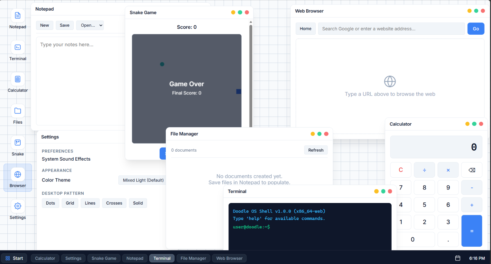

# 🎨 Doodle OS

> *A hand-drawn web operating system that lives in your browser.*

**Doodle OS** is a fully interactive, browser-based desktop environment designed to look and feel like a sketchbook come to life. Built with vanilla HTML, CSS, and JavaScript — no frameworks, no dependencies, just pure creativity.



---

## ✨ Features

| Feature | Description |
|---------|-------------|
| 🔐 **Login Screen** | Password-protected desktop entry (default: `doodle`) |
| 🖥️ **Desktop Environment** | A fully functional desktop with draggable icons, wallpaper, and taskbar |
| 🪟 **Window Manager** | Open, drag, minimize, maximize, and close application windows with z-index layering |
| 📝 **Notepad** | A doodle-styled text editor with **file system support** — create, save, and open files via `localStorage` |
| 💻 **Terminal** | A working command-line interface with commands like `help`, `date`, `whoami`, `echo`, `ls`, and `reboot` |
| 🧮 **Calculator** | Full doodle-styled calculator with +, −, ×, ÷, clear, and backspace |
| 🗂️ **File Manager** | Browse, view, and delete all your saved Notepad files in one place |
| 🐍 **Snake Game** | Classic Snake game with arrow key controls and score tracking |
| 🌐 **Browser** | Type any URL or search term to open it in your real browser tab |
| ⚙️ **Settings** | Toggle between **Light** and **Dark** themes, pick wallpapers, and enable sound effects |
| 📅 **Calendar Widget** | Click the taskbar calendar icon to see the current month |
| 🖼️ **Wallpaper Picker** | Choose from 5 hand-drawn patterns: Dots, Grid, Lines, Crosses, Stars |
| 🎵 **Sound Effects** | Cute beeps and pops on clicks, window actions, and game events |
| ☰ **Start Menu** | Launch apps from the taskbar or desktop icons |
| ⏻ **Shutdown** | A cute shutdown screen to end your session |

---

## 🚀 Live Demo

🎯 **[Try Doodle OS Live](https://DAVIDX-004.github.io/Doodle-OS)**

Or run it locally:

```bash
git clone https://github.com/DAVIDX-004/Doodle-OS.git
cd Doodle-OS
# Open index.html in your browser
```

> No build step. No npm install. Just open `index.html` and go! 🚀

---

## 🛠️ Tech Stack

| Technology | Purpose |
|------------|---------|
| **HTML5** | Semantic structure |
| **CSS3** | Hand-drawn styling with custom properties, animations, and responsive design |
| **Vanilla JavaScript** | Window manager, file system, games, event handling, DOM manipulation |
| **localStorage API** | Persistent file storage, theme, wallpaper, and sound preferences |
| **Web Audio API** | Sound effects for interactions |
| **Canvas API** | Snake game rendering |

---

## 📁 File Structure

```
Doodle-OS/
├── index.html          # Main HTML structure (login + welcome + desktop)
├── style.css           # All hand-drawn styling, animations, dark mode, wallpapers
├── script.js           # OS kernel: window manager, file system, apps, games, audio
└── README.md           # You are here! 👋
```

---

## 🎮 How to Use

### Login
- Enter password: `doodle`
- Click **Unlock** to enter your desktop

### Desktop
- **Single-click** an icon to select it
- **Double-click** an icon to open the app
- Drag windows by their header bar
- Use the **taskbar** to switch between open apps
- Click **📅** on the taskbar to open the calendar popup

### Notepad
- Type freely in the hand-drawn text area
- Click **🆕 New** to clear the editor
- Click **💾 Save** to save your file to local storage
- Use the **📂 Open** dropdown to load previously saved files

### Terminal
- Type commands and press **Enter**
- Try: `help`, `date`, `whoami`, `ls`, `echo hello`, `clear`, `reboot`

### Calculator
- Click buttons just like a real calculator
- Supports addition, subtraction, multiplication, and division

### File Manager
- Browse all your saved Notepad files
- Click **👁️** to view file contents
- Click **🗑️** to delete a file

### Snake Game
- Click the canvas or **Start** button to begin
- Use **Arrow Keys** to move the snake
- Eat the red dots to grow and increase your score
- Don't hit the walls or yourself!

### Browser
- Type any URL (e.g., `google.com`) or search term
- Click **Go** or press **Enter**
- Opens in your real browser tab

### Settings
- Open **⚙️ Settings** and switch between **Doodle Light** and **Doodle Dark**
- Pick your favorite wallpaper pattern
- Toggle sound effects on/off
- All preferences are saved automatically

---

## 🗺️ Roadmap

- [x] Login screen with password protection
- [x] Welcome screen with fade transition
- [x] Desktop with icons and taskbar
- [x] Draggable window manager
- [x] Notepad with file system
- [x] Terminal with command support
- [x] Calculator app
- [x] File Manager
- [x] Snake mini game
- [x] Working Browser
- [x] Light / Dark theme toggle
- [x] Calendar widget
- [x] Wallpaper picker (5 patterns)
- [x] Sound effects
- [ ] 🎵 Background music
- [ ] 🎮 More mini games (Tic-Tac-Toe, Pong)
- [ ] 🔐 Multiple user profiles

---

## 🙋 About the Creator

Hi, I'm **Muhammad Dawood**! 👋

I built Doodle OS as a fun portfolio project to explore what a hand-drawn, sketchbook-style operating system might look like in a browser. Every pixel, animation, and interaction is crafted to feel warm, playful, and uniquely *doodle*.

If you like this project, consider giving it a ⭐ on GitHub!

---

## 🤝 Contributing

Contributions, ideas, and bug reports are welcome! Feel free to open an issue or submit a pull request.

1. Fork the repository
2. Create your feature branch (`git checkout -b feature/amazing-feature`)
3. Commit your changes (`git commit -m 'Add amazing feature'`)
4. Push to the branch (`git push origin feature/amazing-feature`)
5. Open a Pull Request

---

## 📜 License

This project is licensed under the **MIT License** — feel free to use, modify, and distribute.

```
MIT License

Copyright (c) 2026 Muhammad Dawood

Permission is hereby granted, free of charge, to any person obtaining a copy
of this software and associated documentation files (the "Software"), to deal
in the Software without restriction, including without limitation the rights
to use, copy, modify, merge, publish, distribute, sublicense, and/or sell
copies of the Software, and to permit persons to whom the Software is
furnished to do so, subject to the following conditions:

The above copyright notice and this permission notice shall be included in all
copies or substantial portions of the Software.

THE SOFTWARE IS PROVIDED "AS IS", WITHOUT WARRANTY OF ANY KIND, EXPRESS OR
IMPLIED, INCLUDING BUT NOT LIMITED TO THE WARRANTIES OF MERCHANTABILITY,
FITNESS FOR A PARTICULAR PURPOSE AND NONINFRINGEMENT.
```

---

## 🌟 Show Your Support

If you enjoyed Doodle OS, please ⭐ **star this repo** and share it with your friends!

> *"What if your desktop felt less like a machine and more like a sketchbook?"* — Doodle OS

---

<p align="center">
  Made with ❤️ and 🖊️ by <strong>Muhammad Dawood</strong>
</p>
